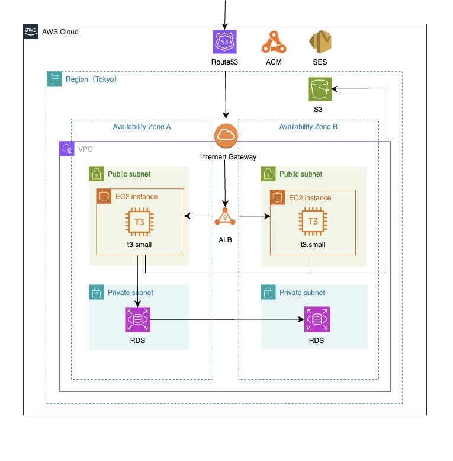

# RestaurantChooser
## サービス概要
出先で飲食店を決めることが手間に感じる。そんな悩みを解決するために作成するアプリケーションです。

一人でどこかに出かけて、お昼をとるレストランを決めようと思っても、選択肢が多くてどれにしようか迷う。
あるいは友人とどこかに出かけても、意見が収束せず、場所が決まらないそういった悩みを解決することを目的としたWebアプリケーションです。
店名、エリア、ジャンル（中華や和食）などの情報を元に気になっているお店を事前に登録しておき、ランダムにおすすめのお店をアプリが選択してくれます。

またお店の自動選択機能以外にも、SNS風の側面も持ち、ちょっとした口コミの投稿やいいね機能なども実装しています。

サービスURl:
https://restaurant-chooser.com

## 開発背景
私の場合なのですが、勤め先ではお昼ご飯の時間が自由で、そのため同僚の方と時間が合うことが少なかったです。
一人で駅中を回ってみても選択肢が多く、判断に迷うことがありました。
それと過去を振り返ってみて、友人とどこかにでかけて食事をする場所を決めようとなっても、意見が中々収束しなかった経験があります。

そうであれば、このような問題を機械に任せて自動化してしまえばよいのではないかと思い、開発に着手しました。

## 機能一覧

* メールアドレスとパスワードを利用したユーザー登録 / ログイン機能
* マイページ表示機能
* ユーザー情報変更機能
* パスワード再設定機能
* ゲストユーザー機能
* お店の取得 / 作成 / 更新 / 削除機能
* お店の自動選択機能
* お店の検索機能
* お店情報詳細表示機能
* GoogleMap　表示/検索機能
* いいね取得/削除機能
* ページネーション機能
* 画像のアップロード機能（ユーザー、お店、ポスト）

## 使用技術
* バックエンド: Ruby 3.1.0/Rails 7.0.4
* テストフレームワーク: RSpec
* フロントエンド: JavaScript/ Tailwind css /swiper/esbuild/yarn/node.js/google map api
* インフラ: AWS(Route53 / Certificate Manager / ALB / VPC / ACM/　SES/　RDS MySQL / S3) / Nginx 
* 環境構築: Docker / Docker Compose　

## 使用選定理由
* バックエンド : Ruby / Ruby on Rails 

ProgateやRailsチュートリアルといった定番の学習サービスがあり、日本初のプログラミング言語であるため日本語ベースの情報が多く、学習する環境が整っていたこと。また、Web系では幅広く使われている技術であるためです。

* フロントエンド : Javascript、tailwindCSS,esbuild,yarn,node.js

JavaScriptについては非同期の処理を実現したい箇所があり、Railsのみだとそれは限界があるので、動的に処理ができるようになるJSを導入した。 
確かにReactやTypescriptなど他の技術もありましたが、それらはJavaScriptがベースになっているので、それだったらJSをここでやって理解を深めた方がいいと思い、それに注力しました。

tailwindCSSについては自力でCSSを適応させて画面を作っていたら。全画面が同じ規格で作られていない、画面が崩れている、そもそもセンスを感じないという事態になっていました。後からtailwindCSSという事前に定義済の部品を利用できるものがあることを知り、これなら画面が整っていない問題を解決できるし、効率的に画面作成ができると思い採用しました。 

esbuildについては他にもフロントエンド管理をするものはありました（importmapやgem経由など）。調査の結果そちらだとインタフェースが必要とか少し手順が煩雑そうで、他にもtailwindCSSやswiperなどとフロントエンドのライブラリを導入する計画があり、esbuildであれば一括で実現できると知り、package.jsonでそれを一括管理し、それに付随するnode.jsとyarnを導入しました。 
 
* AWS 

基本情報技術者試験について、合格はしたもののネットワークの苦手意識があり、どこかで理解を深めていきたいと思っていました。以前はherokuにデプロイしていましたが、PaaSであるため殆どサービス側で設定がされており、その過程で得るものが少なかったです。AWSだとIaaSなので幅広く自分で設定ができ、知識や経験を増やせると思ったからです。また、GCPなどの他のプラットフォームに比べて、実例や教材が充実しており学習がしやすかったため。 

* Docker 

流行りの技術でそももそもコンテナやイメージとか調べてもよく内容が分かりませんでした。私の場合ですがIT系の知識なりスキルは経験的に調べたり・読んでも理解できなかったものは、実際に触ってみると見えてくることがあるので、まずは触れてみようと思いました。 
今後webエンジニアとして業務を行なっていくなら使う機会も増えるし、基本的な概念や操作方法などを知る必要はあると思うし、経験を積んだら環境構築も行う可能性があると思い、導入しました。

* Nginx 

前提として開発環境ではAP・Webサーバーの処理はPumaに任せていた、AWSへデプロイとなるとWebサーバーの設定が必要となり導入しました。
RailsアプリをDocker環境で運用する場合、Nginxとセットで使う構成は実務でも多いと聞き、構築手順を通じてその仕組みを体験したいと考えました。 
MVC原則というものがある通り、VCの範囲を定めていなかった、よく聞く概念なのでここでやるべきことを決め、これも経験しておくべきだと判断しました。 
また本番環境と開発環境の差分をなくしたかったので、コンテナ化を行いました。 

## インフラ図

## ER図
https://docs.google.com/spreadsheets/d/1ccJjuL7yKKyiZBmzMQFPr0-0zuEShTpMUaSPIfCMP60/edit?usp=sharing
